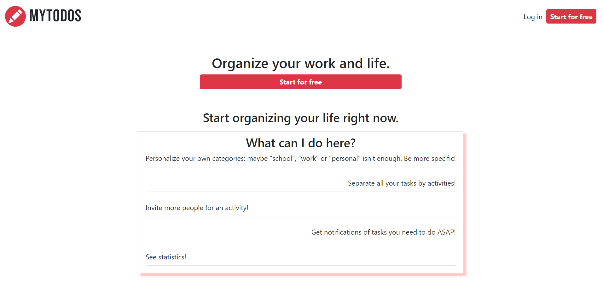

# MyTodos

## 	💻 Technologies

This project was made using:
- Backend: Node, Express, Mongoose, Bcryptjs, JWT, Jest & Axios (testing)
- Frontend: Vue, Bootstrap, Axios

## 	💻 Project

This project is a productivity and task management app like Todoist and Trello.
The project was inspired by Rocketseat's 2019 Omnistack Course.
- [backend](https://github.com/rocketseat-education/curso-omnistack-back-end)
- [frontend](https://github.com/rocketseat-education/curso-omnistack-front-end)

## 	💻 Features

- [X] User Authentication: register, login, forgot password
- [ ] User Profile: see data, edit data (password and avatar), delete account
- [ ] Activity Categories: create, edit and delete
- [ ] Activity: create, edit, delete
- [ ] Activity's Task: create, edit, delete
- [ ] Task Comments: create, edit, delete
- [ ] Filter Tasks: by category, status, date
- [ ] User Invites: invite user for task group
- [ ] User Roles: give invited user a role that determines its permissions on activity
- [ ] Notifications: tasks to do on logged day / missed since last login
- [ ] Statistics: see how many tasks are done/to do + activities by category

## 	💻 API Documentation

REST API routes and response examples are documented in this Postman URL(TBA).

## 	💻 API Testing

Database and API testing are separated on different package scripts to avoid interfering with one another.
To run both you need to have your own .env file.
For API tests, you also need to run "dev" script.

## 	💻 Layout

All pages are on 'frontend_screenshots' folder with 2 versions: desktop and mobile.

